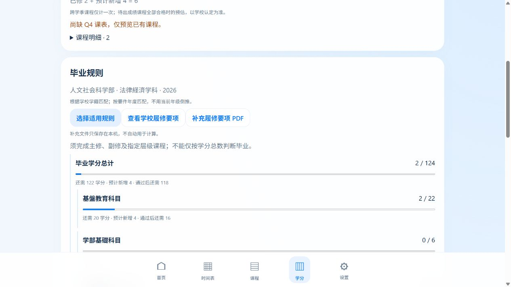
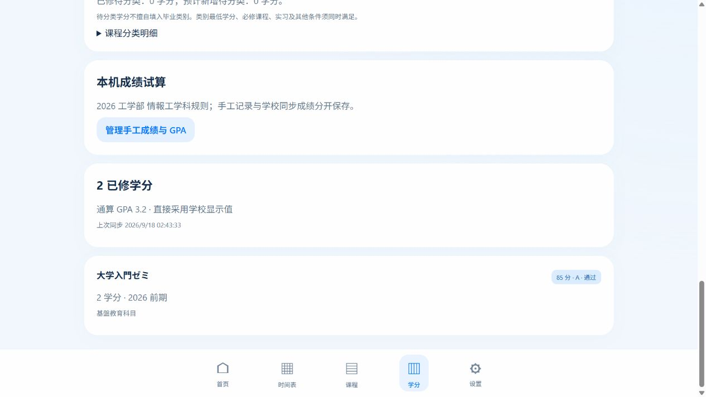
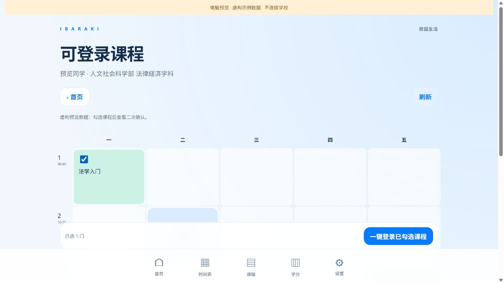
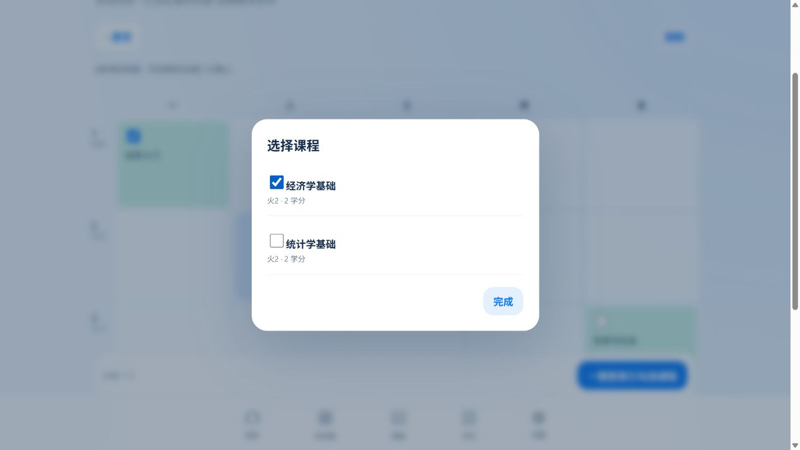

# 功能预览 / 機能プレビュー / Feature preview

以下是 iOS 界面的电脑浏览器预览，全部为虚构示例数据，不连接学校，也不表示已完成真实选课。手机布局会随屏幕尺寸调整。

以下は架空データによる iOS UI のブラウザープレビューです。学校への接続・実際の履修登録は行っていません。

These are browser previews of the iOS interface with fictional data, not physical-device screenshots or evidence of live registration.

## 首页 / ホーム / Home

## 学期学分预测 / 単位予測 / Semester forecast

## 毕业所需分类学分 / 卒業要件 / Graduation gaps

## 课程成绩与 GPA / 成績 / Grades

## 只提交勾选课程 / 選択科目 / Selected-only registration

## 同一时段多课程选择 / 科目選択 / Course selection dialog

