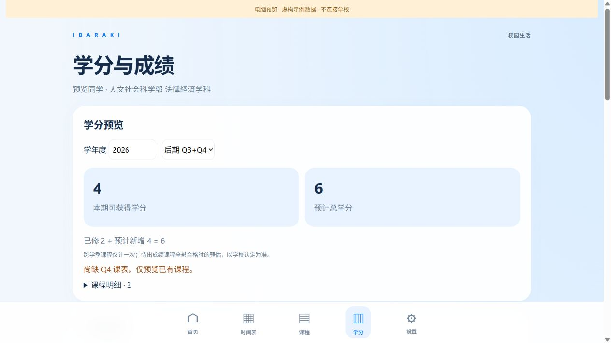

# 茨城大学 Campus Assistant · 教务助手

**Android · iPhone · iPad** — YIN

[日本語](#日本語) · [中文](#中文) · [English](#english) · [Downloads](#downloads)

**[iOS 署名・インストール / 签名与安装教程 / Signing guide](IOS-INSTALL.md)** · **[機能プレビュー / 功能截图 / Screenshots](FEATURE-PREVIEW.md)**

無料の個人署名は通常 7 日ごとに更新 / 免费个人签名通常每 7 天续签一次 / Free personal signing normally needs renewal every 7 days. See the linked guide for Apple documentation and renewal steps.

## 日本語

**茨城大学専用の非公式・オープンソース履修支援アプリです。** 他大学には対応していません。大学が提供・認定するアプリではありません。

- **学期の修得見込み単位**：前期・後期・Q1～Q4 の履修科目から見込みを確認。学期をまたぐ科目の重複、修得済み、不合格を区別します。
- **卒業までに必要な単位**：学部・学科・コースと要件年度に応じて、単位区分ごとの必要数・修得数・不足数・履修中科目が合格した場合の見込みを表示します。
- **成績と GPA**：学校の成績・評価・単位・通算 GPA を表示。学校データと分離した手入力の成績試算も利用できます。
- **履修登録**：登録可能科目を月～金の仮時間割で確認。同じ枠に複数科目がある場合は件数から選択できます。チェックした科目だけをまとめて登録し、送信前に再確認します。結果不明時は重複送信を止めます。
- **時間割・通知**：週／月カレンダー、日付と学期の連動、オンライン授業の表示、シラバス、学校のお知らせ、個人予定の編集、カレンダーの書き出し、単位・GPA・登録可能科目の通知。
- **継続的な同期**：アプリに戻った際に学校データを更新。読み取りに失敗した場合は保存済みデータを保持します。

公開資料から確認した 2024～2026 要件年度のルールを使用します。未対応年度・未分類科目は未確認として残します。単位予測は未確定科目の合格を仮定した参考値です。必修、資格、実習、卒業研究等の条件も必要なため、卒業可否は大学の正式な判定を確認してください。

**Apple 製品の実機を所有していないため、iOS 版には一部不具合が残っている可能性があります。** macOS クラウドビルドと iOS シミュレーターで検証しますが、実機での学校認証・通知・履修登録の動作を保証するものではありません。配布 IPA は**未署名**であり、iPhone に入れるにはご自身の Apple アカウント／証明書で署名する必要があります。App Store／TestFlight 配布ではありません。

連絡先：**YIN · [snai2514@gmail.com](mailto:snai2514@gmail.com)**

## 中文

**仅适用于茨城大学的非官方开源校园助手，不支持其他大学。** 项目由学生独立维护，非学校官方提供或认证。

- **预览一个学期可得的学分**：支持前期、后期及 Q1—Q4，区分已修得、不合格与预计新增，跨学季课程不重复计算。
- **查看距离毕业还缺哪些学分**：根据学部、学科、专业方向及要件年度，显示各类别要求、已修、缺口，以及本期课程通过后的预计进度。
- **查看课程成绩与 GPA**：显示学校成绩、分数、等级、学分和通算 GPA，也可单独管理本机手工成绩试算。
- **登录课程（履修登记）**：首页进入“可登录课程”，在周一至周五的临时周历勾选。一个格子有多门课时显示数量，点开弹窗具体选择；一键提交只包含已勾选课程，必须二次确认，结果不明时阻止重复提交。
- **课程与日程管理**：周／月日历、日期与学季联动、线上授课识别、课程大纲、学校公告、个人安排编辑及日历导出；发现学分、GPA 变化或可登记课程时通知。
- **自动同步**：回到应用时更新学校数据，读取超时或失败保留原记录。

两端使用同源的公开毕业规则和课程分类数据，覆盖已核对的 2024—2026 要件年度。未知规则或未分类课程保持待核对。学分预览是假设待出成绩课程合格时的估算；必修、资格、实习及毕业研究等条件仍须满足，最终以学校认定为准。

**因为没有苹果相关的实机设备，所以苹果版可能存在部分 Bug。** macOS 云构建及 iOS 模拟器验证不能保证真机上的学校登录、通知、履修提交全部正常。苹果下载文件为**未签名 IPA**，需要使用自己的 Apple 账号／证书签名后安装，不是点开即可安装的 App Store 或 TestFlight 链接。

联络：**YIN · [snai2514@gmail.com](mailto:snai2514@gmail.com)**

## English

**An unofficial, open-source campus assistant exclusively for Ibaraki University.** Other universities are not supported. This independent student project is not provided or endorsed by the university.

- **Semester credit forecast** for the first/second semester and Q1–Q4, with cross-quarter deduplication and separate treatment of earned, failed and pending credits.
- **Remaining graduation requirements**, showing required, earned and missing credits by curriculum category, plus projected progress if current courses are passed.
- **Grades and GPA**, using school-reported results and cumulative GPA, with a separate local manual grade calculator.
- **Course registration**, using a Monday–Friday preview timetable. A count opens a selection dialog when several courses share a slot. Batch registration submits checked courses only, requires a second confirmation and blocks automatic resubmission when the result is uncertain.
- **Timetable and study tools**: week/month views, linked dates and quarters, online teaching labels, syllabi, school notices, editable personal events, calendar export and meaningful academic/registration notifications.
- **Foreground synchronization**, refreshing school data when returning to the app and preserving cached records on failed reads.

Both platforms use the same exported public curriculum rules and classification data for reviewed 2024–2026 curriculum cohorts. Unsupported rules and unclassified courses remain unresolved. Forecasts assume pending courses are passed; required courses, placements, qualifications and thesis conditions still apply. The university determines graduation eligibility.

**No physical Apple devices are available for development, so the iOS version may still contain bugs.** macOS builds and iOS Simulator checks do not guarantee real-device school authentication, notifications or registration. The downloadable IPA is **unsigned** and needs your own Apple signing before installation; it is not an App Store or TestFlight installation link.

Contact: **YIN · [snai2514@gmail.com](mailto:snai2514@gmail.com)**

## Theme packs / 美化包 / テーマパック

[制作教程 / Authoring guide / 作成ガイド](THEME-PACKS.md) · [学分规则核对记录 / Credit rule audit](CREDIT-RULE-AUDIT.md)

任意浅深色配色、页面与卡片背景、独立弹窗颜色、内置桌面图标和 PNG 启动动画。Custom light/dark colors, backgrounds, dialog colors, bundled icons and PNG startup animations. 配色・背景・ダイアログ・内蔵アイコン・起動アニメーションを変更できます。

## Android 1.0.89

修复学校开放选课后课表解析与 Q3 同步超时。可登录课程直接显示原生周历，支持第 5 限、开课学部、同格和跨格多选。一次确认整份清单后依次发送，全部处理后自动统一查询结果；中断时保存已发送记录，重新打开只查询、不重复提交。学校的资格与学分上限仍然适用。

Android update: native course candidates with offering faculty, fifth-period support and multi-selection. Approve the complete list once, send courses sequentially, then verify the whole batch together. Interrupted batches are recovered with read-only queries and never automatically replayed. iOS remains at 1.0.82; this Android update is not included in that IPA.

## Downloads

| ダウンロード / 下载 / Download | 直リンク / 直达链接 / Direct link |
| --- | --- |
| Android APK · Android 7.0+ | [CampusAssistant-Android-1.0.89.apk](https://github.com/snai2514-boop/ibaraki-campus/releases/download/v1.0.89/CampusAssistant-Android-1.0.89.apk) |
| iPhone / iPad · iOS 16+ · 未署名 / 未签名 / unsigned | [CampusAssistant-1.0.82-unsigned.ipa](https://github.com/snai2514-boop/ibaraki-campus/releases/download/v1.0.82/CampusAssistant-1.0.82-unsigned.ipa) |
| Android + iOS ソース / 完整源码 / full source | [CampusAssistant-1.0.89-source.zip](https://github.com/snai2514-boop/ibaraki-campus/releases/download/v1.0.89/CampusAssistant-1.0.89-source.zip) |
| 最新ソース / 最新源码 / latest source | [ZIP](https://github.com/snai2514-boop/ibaraki-campus/archive/refs/heads/main.zip) · [Android](android/) · [iOS](CampusAssistant/) |
| 配布一覧 / 发布页 / release page | [v1.0.89](https://github.com/snai2514-boop/ibaraki-campus/releases/tag/v1.0.89) |

## Preview / 功能预览 / プレビュー

虚构数据的 iOS 浏览器预览 / 架空データのブラウザープレビュー / iOS browser preview with fictional data.



[更多截图：毕业缺口、成绩、周历选课 / More screenshots](FEATURE-PREVIEW.md)

## Build / ビルド / 构建

Android source is in `android/`. Use JDK 17 and Android SDK 37:

```sh
cd android
./gradlew testDebugUnitTest assembleDebug
```

Release signing uses your own credentials; no private keys are included. The release APK is separately signed by the maintainer.

iOS source is at repository root. On a Mac with Xcode, Python 3 and Node.js:

```sh
bash tools/build.sh
```

Open `CampusAssistant.xcodeproj`, select your own signing Team and run on your device. Build output is in `build/dist/`. For offline browser preview:

```sh
node --test Tests/core.test.cjs Tests/academic.test.cjs
python3 -m http.server 8765 --bind 127.0.0.1 --directory CampusAssistant/Web
```

Visit `http://127.0.0.1:8765/?preview=1`. All preview records are fictional; this mode never contacts the school.

## Privacy & license / 隐私与许可 / プライバシーとライセンス

School credentials, sessions, personal grades, student records, device logs, signing keys and local Git history are excluded from this repository and source packages. The maintainer explicitly chose to publish the contact email above. Course classifications are from public university materials; mock records are fictional. See [DATA-SOURCES.md](DATA-SOURCES.md) and [VALIDATION.md](VALIDATION.md).

GPL-3.0. Android is based on [znjhahaha/zhengfang-apk](https://github.com/znjhahaha/zhengfang-apk); original attribution remains in [NOTICE.md](NOTICE.md) and [LICENSE](LICENSE). University materials and third-party dependencies retain their respective rights.

